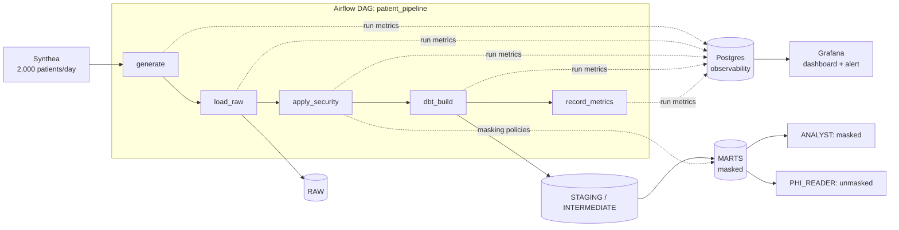
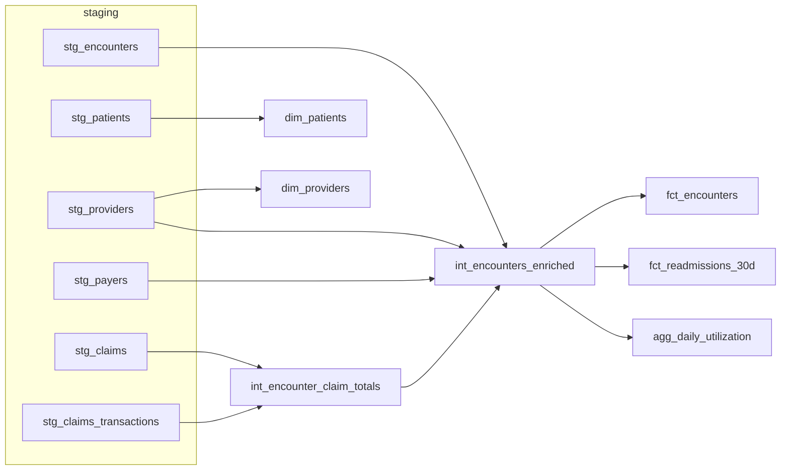
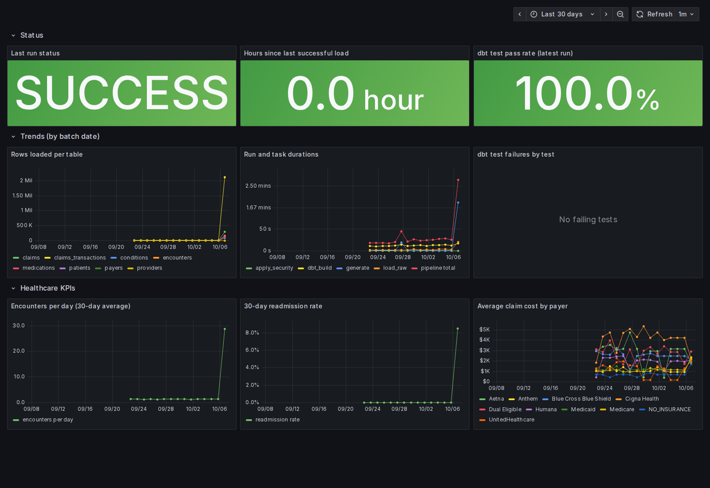

# Healthcare Data Platform

[](https://github.com/justinko157/healthcare-data-platform/actions/workflows/ci.yml)

A daily pipeline for synthetic patient records: **Synthea → Airflow → Snowflake (or DuckDB) → dbt**.
It **masks direct identifiers and enforces role-based access** in Snowflake and is monitored live in **Grafana**.
Every record is synthetic; no real patient data is ever used.



## Quickstart (no accounts needed)

```bash
git clone https://github.com/justinko157/healthcare-data-platform
cd healthcare-data-platform
docker compose up -d --build
```

- Airflow: http://localhost:8080 (no login in this local demo). `patient_pipeline` starts on its own. On the first `up`, the `seed-history` service backfills 14 days from the bundled sample data. It re-checks that window on every `up` and fills any missing dates with sample data.
- Grafana: http://localhost:3000. "Patient Pipeline Health" is the home dashboard (admin / admin).

The first build takes a few minutes (Java and Synthea are installed). The scheduled daily run uses real Synthea with 2,000 patients; only the backfilled history comes from sample data.
Built on Airflow 3.1.0, dbt-core 1.12, DuckDB 1.4, Grafana 12.2 and Synthea v3.3.0.
On Linux, run `echo "AIRFLOW_UID=$(id -u)" >> .env` first so the containers can write `./data`.

Local development without Docker:

```bash
uv sync
uv run pytest
uv run python -m ingest.cli generate --batch-date 2026-01-01 --use-sample
uv run python -m ingest.cli load --batch-date 2026-01-01
uv run python -m ingest.cli dbt-build --batch-date 2026-01-01
```

These commands use the same `data/warehouse.duckdb` and `data/batches/` as the running stack. Stop the stack first (`docker compose stop`), or point them somewhere else:

```bash
export DATA_DIR=/tmp/hdp-dev DUCKDB_PATH=/tmp/hdp-dev/warehouse.duckdb
```

**Disk use.** Real Synthea writes about 1 GB of CSV per day at 2,000 patients. The pipeline keeps only the 3 newest batch directories under `data/batches/` and 30 days of batches in RAW. DuckDB doesn't shrink its file when rows are deleted; run `CHECKPOINT` or recreate `data/warehouse.duckdb` to reclaim space. To generate less, set a smaller `SYNTHEA_POPULATION` in `.env` (for example `SYNTHEA_POPULATION=500`) and run `docker compose up -d`.

## Snowflake mode: masking and least-privilege roles

Account setup is Terraform ([`terraform/`](terraform/)), run through Docker so there is nothing to install:

1. Start a Snowflake trial (Enterprise edition: masking policies need it).
2. Create two key pairs: `./scripts/snowflake_keygen.sh` (the pipeline's user) and `./scripts/snowflake_keygen.sh terraform` (the user Terraform logs in as).
3. In Snowsight, as ACCOUNTADMIN, run **part 1** of [`terraform/bootstrap_terraform_user.sql`](terraform/bootstrap_terraform_user.sql), pasting in the `terraform` public key. This is the only SQL run by hand.
4. Copy `terraform/terraform.tfvars.example` to `terraform/terraform.tfvars` and fill in your account identifier and user name. Then run:
   ```bash
   ./scripts/tf.sh init
   ./scripts/tf.sh plan
   ./scripts/tf.sh apply
   ```
5. Copy `.env.example` to `.env` (on Linux, keep your `AIRFLOW_UID` line: uncomment it there), set `WAREHOUSE=snowflake`, `SNOWFLAKE_ACCOUNT` and `SNOWFLAKE_PRIVATE_KEY_PATH=/opt/project/secrets/hdp_service_key.p8`, then run `docker compose up -d`.
6. Trigger `patient_pipeline`, then run `snowflake/demo_queries.sql`.

**Adopting an account set up before Terraform** (with the old `bootstrap.sql`): also run **part 2** of the snippet. It moves ownership to SYSADMIN and SECURITYADMIN, so Terraform can manage the objects. Then set `adopt_existing_account = true` in `terraform.tfvars`. The first `plan` imports everything and shows only one change: CREATE TABLE revoked from TRANSFORMER on the view-only schemas. Leave the flag `false` on a fresh account: imports of objects that don't exist fail.

| Role | Can do |
|---|---|
| `LOADER` | write `RAW` (Airflow ingest) |
| `TRANSFORMER` | read `RAW`, build `STAGING`/`INTERMEDIATE`/`MARTS` (dbt) |
| `ANALYST` | read `MARTS`; direct identifiers masked (names, SSN, license, passport, street address, ZIP); birth and death dates cut to the year; patient ID hashed |
| `PHI_READER` | read `MARTS` unmasked |
| `PLATFORM_ADMIN` | own and update masking policies |

### Masked vs unmasked

The same three patients, from a real Snowflake trial run ([`snowflake/demo_queries.sql`](snowflake/demo_queries.sql); all data is synthetic).

As `ANALYST`:

| PATIENT_ID | FIRST_NAME | LAST_NAME | SSN | BIRTH_DATE | CITY | AGE_YEARS |
|---|---|---|---|---|---|---|
| 06f3e58e47fe…26ffdf | \*\*\*MASKED\*\*\* | \*\*\*MASKED\*\*\* | \*\*\*MASKED\*\*\* | 1988-01-01 | Dedham | 38 |
| 087fad91eb6f…5e76b6 | \*\*\*MASKED\*\*\* | \*\*\*MASKED\*\*\* | \*\*\*MASKED\*\*\* | 1973-01-01 | Revere | 53 |
| 0b90364376a1…3fc5d | \*\*\*MASKED\*\*\* | \*\*\*MASKED\*\*\* | \*\*\*MASKED\*\*\* | 2015-01-01 | Boston | 11 |

As `PHI_READER`:

| PATIENT_ID | FIRST_NAME | LAST_NAME | SSN | BIRTH_DATE | CITY | AGE_YEARS |
|---|---|---|---|---|---|---|
| f3aa70e2-d777-e5ba-288f-aa5469241c9d | Lavelle273 | Hilll811 | 999-15-3798 | 1988-03-26 | Dedham | 38 |
| 5e30f14c-15ab-b668-fb6f-03fb3c3f4e66 | Wilburn655 | Goodwin327 | 999-89-7733 | 1973-04-12 | Revere | 53 |
| 821038cb-93d8-070c-3e45-ba5c391a2601 | Hanh683 | Walsh511 | 999-72-4527 | 2015-08-16 | Boston | 11 |

Analysts can still join and count, because `patient_id` is hashed the same way in every mart: as `ANALYST`, `FCT_ENCOUNTERS` joins to `DIM_PATIENTS` on 1,596 encounters. And `ANALYST` cannot see raw data at all: `select count(*) from HEALTHCARE.RAW.PATIENTS` fails with *"Schema 'HEALTHCARE.RAW' does not exist or not authorized."* Full output, including which policies are attached to which columns: [`docs/snowflake_demo_output.md`](docs/snowflake_demo_output.md).

This masks direct identifiers, which makes the `ANALYST` view a limited data set. It is **not** HIPAA Safe Harbor de-identification: analysts still see exact encounter, discharge and readmission timestamps, city, county and state, exact age in years, and gender, race, ethnicity and marital status.

**DuckDB has no masking.** In DuckDB mode the data is unmasked. The PII declarations are still tested: `assert_pii_columns_are_masked` fails the build if any mart column holding PII lacks a masking policy, or if a mart has a column not documented in YAML.

## Data model



Tests: `unique`/`not_null` on keys, `relationships` from facts to dimensions, and `accepted_values` on encounter class. Custom tests check that encounter stop ≥ start, that claim totals equal the sum of their lines, that the readmission rate is in [0, 1], and PII coverage. Source freshness warns after 26 hours.

## Observability



Every pipeline step records its own outcome in Postgres (`observability` schema): run status, per-task duration, rows loaded per table, every dbt node result, and KPIs. Grafana reads it through a read-only login.

- **Status:** last run, hours since the last successful load (red after 26 hours), dbt test pass rate.
- **Trends:** rows loaded, durations, failing dbt tests.
- **Healthcare:** encounters per day, 30-day readmission rate, average claim cost by payer.

The alert **"Patient pipeline stale or failed"** fires when there has been no successful load for 26 hours or the latest run failed. To get notified, add a contact point in Grafana (Alerting → Contact points → email or Slack webhook) and route the `severity=critical` label to it.

## Design decisions

- **Idempotent loads.** Each day is a batch (`_BATCH_ID`). A load deletes that batch and reloads it in one transaction, so rerunning a day never duplicates rows.
- **No unmasked window.** dbt rebuilds marts with `CREATE OR REPLACE`, which drops masking policies. The `secure_model` post-hook re-attaches the policies **before** granting `SELECT` to analysts.
- **Masking that can't be bypassed by role inheritance.** Policies check `CURRENT_ROLE() = 'PHI_READER'`, so neither SYSADMIN's role hierarchy nor secondary roles unmask data. Policies are updated with `ALTER ... SET BODY`, because Snowflake refuses `CREATE OR REPLACE` on a policy that is attached to a column.
- **Neither the pipeline nor Terraform holds ACCOUNTADMIN.** Terraform logs in as a key-pair service user with SYSADMIN (warehouse, database, schemas) and SECURITYADMIN (roles, users, grants). ACCOUNTADMIN is used once, by a human, to create that user. The pipeline's service user is key-pair only and holds LOADER, TRANSFORMER and PLATFORM_ADMIN.
- **Access as code, drift made visible.** Roles and grants are maps in `terraform/grants.tf`, and offline `terraform test` runs in CI pin the masking invariants: analysts never get SELECT or future grants on MARTS, and the service user has no secondary roles. Moving the hand-run setup into Terraform surfaced two over-grants (CREATE TABLE on view-only schemas, a warehouse grant for a role that only runs DDL), and both were cut. State is a local file; a team would use a remote backend.
- **Airflow orchestrates; the CLI does the work.** Every task runs `python -m ingest.cli ...` in its own venv, so dbt and the Snowflake connector never conflict with Airflow's packages, and everything runs the same locally.
- **The DAG run fails when any step fails.** `record_metrics` runs after failures (`all_done`) so they reach the dashboard. It then exits non-zero so Airflow's run state matches.
- **Postgres instead of Prometheus for metrics.** These are per-run batch facts, not scraped time series. Grafana reads Postgres natively, and it's already in the stack.
- **One DuckDB writer, one Airflow pool slot.** DuckDB allows a single writer at a time, so the default pool has one slot and backfill runs share the warehouse with the scheduled run instead of failing on the file lock.
- **DuckDB fallback.** The repo keeps working after the Snowflake trial ends, and CI needs no secrets.
- **Unsalted SHA-256 for patient IDs** is fine here because Synthea IDs are random UUIDs. Real systems should use a keyed hash (HMAC) so low-entropy identifiers can't be brute-forced.

## Next milestones

- OpenTelemetry tracing across the Airflow tasks
- Data contracts on the RAW layer
